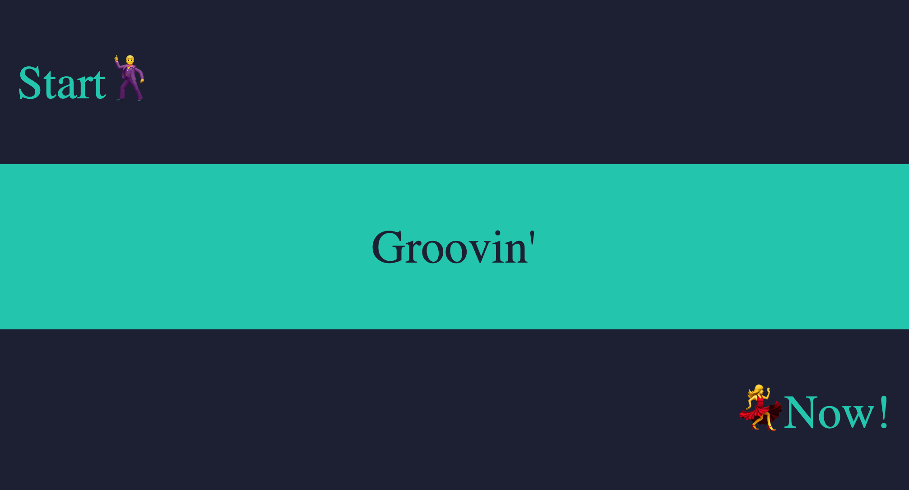
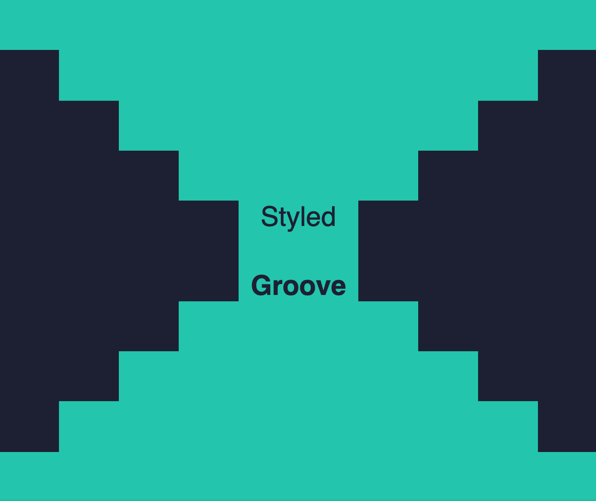

# styled-groove 💃🕺


[](https://coveralls.io/github/coldbrewcoders/styled-groove?branch=master)


A library used with `styled-components` 💅🏻that provides dynamic, component-level styling via props. Extending your components with `styled-groove` allows for more flexibility and reusability in your styled components. `Styled-groove` also has rich feature support for responsive styling. 


## Install

```
$ npm install --save styled-groove
or
$ yarn add styled-groove
```


## Quick Start

Apply Groove to any styled component by adding the `applyGroove()` function to the bottom of your `styled` template.

```js
import styled from "styled-components";
import applyGroove from "styled-groove";

const Example = styled.div`
  .
  .
  .

  ${props => applyGroove(props)}
`;
```


## How It Works
`styled-groove` is a mixin that contains most CSS properties. The `applyGroove()` function examines the props passed to the component, finds applicable styles and injects them as valid CSS to style your component.

The primary intent is to remove the repetition of having to declare multiple styled-components in favor of declaring one and, if needed, extending it on a per use basis.


# Examples 
## Before & After
By allowing styles to be applied to components in-line, there becomes less of a need to define new styled-components. This is a simple example, but highlights the main purpose of `styled-groove`.

### Before:
```jsx
import styled from "styled-components";

const Button1 = styled.button`
  background-color: #4CAF50;
  border: none;
  color: white;
  text-align: center;
  display: inline-block;
  font-size: 16px;
  cursor: pointer;
  margin-right: 4px;
`;

const Button2 = styled.button`
  background-color: #4CAF50;
  border: none;
  color: white;
  text-align: center;
  display: inline-block;
  font-size: 16px;
  cursor: pointer;
  margin-left: 4px;
`;

.
.
.

<Button1>Save</Button1>
<Button2>Cancel</Button2>
```

### After:
```jsx
import styled from "styled-components";
import applyGroove from "styled-groove";

const Button = styled.button`
  background-color: #4CAF50;
  border: none;
  color: white;
  text-align: center;
  display: inline-block;
  font-size: 16px;
  cursor: pointer;

  ${props => applyGroove(props)}
`;

.
.
.

<Button marginRight="4px">Save</Button>
<Button marginLeft="4px">Cancel</Button>
```

## Implementation with Theme
https://www.styled-components.com/docs/advanced#theming

If you're using a theme object with `styled-components`, you can add `applyGrove` to make it available in every styled-component definition. Also, if you use any custom config options (config options will be discussed below), this is an ideal implementation for your customizations to be applied throughout your entire app.

```jsx
import { ThemeProvider } from "styled-components";
import applyGroove from "styled-groove";

const theme = {
  .
  .
  .

  // Default settings for applyGroove
  applyGroove
};

or

import { ThemeProvider } from "styled-components";
import { applyGrooveCustomConfig } from "styled-groove";

// Defining theme
const theme = {
  ...,

  // Custom config for applyGroove
  applyGroove: applyGrooveCustomConfig({
    mediaStrategy: "down",
    mediaBreakpoints: { xs: 255, sm: 320, md: 450, lg: 799, xl: 800 }
  })
};

...

// Wrap your app in styled-component's ThemeProvider
<ThemeProvider theme={theme}>
  ...
</ThemeProvider>

```

Now we have access to `applyGroove` in all of our styled components via the theme object.

```js
import styled from "styled-components";

const Title = styled.h1`
  font-size: 1.5em;
  text-align: center;
  color: #fff;

  // Access to appGroove() in any styled-component
  ${(props) => props.theme.applyGroove(props)}
`;
```


# Style Props:

### Display props:

| Prop (key)    | Template Literal CSS Fn (value)               |
| --------------|:----------------------------------------------:
| display       | (value) => css\`display: ${value};`           |
| position      | (value) => css\`position: ${value};`          |
| float         | (value) => css\`float: ${value};`             |
| clear         | (value) => css\`clear: ${value};`             |
| overflow      | (value) => css\`overflow: ${value};`          |
| overflowX     | (value) => css\`overflow-x: ${value};`        |
| overflowY     | (value) => css\`overflow-y: ${value};`        |
| visibility    | (value) => css\`visibility: ${value};`        |
| zIndex        | (value) => css\`z-index: ${value};`           |


### Sizing props:

| Prop (key)    | Template Literal CSS Fn (value)               |
| --------------|:----------------------------------------------:
| height        | (value) => css\`height: ${value};`            |
| width         | (value) => css\`width: ${value};`             |
| minHeight     | (value) => css\`min-height: ${value};`        | 
| minWidth      | (value) => css\`min-width: ${value};`         |
| maxHeight     | (value) => css\`max-height: ${value};`        |
| maxWidth      | (value) => css\`max-width: ${value};`         |


### Margin props:

| Prop (key)    | Template Literal CSS Fn (value)                                 |
| --------------|:----------------------------------------------------------------:
| margin        | (value) => css\`margin: ${value};`                              |
| marginTop     | (value) => css\`margin-top: ${value};`                          |
| marginBottom  | (value) => css\`margin-bottom: ${value};`                       | 
| marginLeft    | (value) => css\`margin-left: ${value};`                         |
| marginRight   | (value) => css\`margin-right: ${value};`                        |
| marginX       | (value) => css\`margin-left: ${value}; margin-right: ${value};` |
| marginY       | (value) => css\`margin-top: ${value}; margin-bottom: ${value};` |                           |


### Padding props:

| Prop (key)    | Template Literal CSS Fn (value)                                   |
| --------------|:------------------------------------------------------------------:
| padding       | (value) => css\`padding: ${value};`                               |
| paddingTop    | (value) => css\`padding-top: ${value};`                           |
| paddingBottom | (value) => css\`padding-bottom: ${value};`                        |  
| paddingLeft   | (value) => css\`padding-left: ${value};`                          |
| paddingRight  | (value) => css\`padding-right: ${value};`                         |
| paddingX      | (value) => css\`padding-left: ${value}; padding-right: ${value};` |
| paddingY      | (value) => css\`padding-top: ${value}; padding-bottom: ${value};` |                         |


### Positioning props:

| Prop (key)    | Template Literal CSS Fn (value)               |
| --------------|:----------------------------------------------:
| top           | (value) => css\`top: ${value};`               |
| bottom        | (value) => css\`bottom: ${value};`            |
| left          | (value) => css\`left: ${value};`              |
| right         | (value) => css\`right: ${value};`             |


### Typography props:

| Prop (key)    | Template Literal CSS Fn (value)               |
| --------------|:----------------------------------------------:
| color         | (value) => css\`color: ${value};`             |
| fontSize      | (value) => css\`font-size: ${value};`         |
| fontWeight    | (value) => css\`font-weight: ${value};`       |
| fontFamily    | (value) => css\`font-family: ${value};`       |
| fontStyle     | (value) => css\`font-style: ${value};`        |
| textAlign     | (value) => css\`text-align: ${value};`        |
| textDecoration| (value) => css\`text-decoration: ${value};`   |
| hoverColor    | (value) => css\`&&{&:hover{color: ${value};}}`|
| lineHeight    | (value) => css\`line-height: ${value};`       |
| letterSpacing | (value) => css\`letter-spacing: ${value};`    |
| hyphens       | (value) => css\`hyphens: ${value};`           |
| textOverflow  | (value) => css\`text-overflow: ${value};`     |
| textShadow    | (value) => css\`text-shadow: ${value};`       |
| textTransform | (value) => css\`text-transform: ${value};`    |
| light         | () => css\`font-weight: 300;`                 |
| bold          | () => css\`font-weight: bold;`                |


### Border props:

| Prop (key)              | Template Literal CSS Fn (value)                                                                     |
| ------------------------|:----------------------------------------------------------------------------------------------------:
| border                  | (value) => css\`border: ${value};`                                                                  |
| borderTop               | (value) => css\`border-top: ${value};`                                                              |
| borderBottom            | (value) => css\`border-bottom: ${value};`                                                           |
| borderRight             | (value) => css\`border-right: ${value};`                                                            |
| borderLeft              | (value) => css\`border-left: ${value};`                                                             |
| borderColor             | (value) => css\`border-color: ${value};`                                                            |
| borderRadius            | (value) => css\`border-radius: ${value};`                                                           |
| borderTopLeftRadius     | (value) => css\`border-top-left-radius: ${value};`                                                  |
| borderTopRightRadius    | (value) => css\`border-top-right-radius: ${value};`                                                 |
| borderBottomRightRadius | (value) => css\`border-bottom-right-radius: ${value};`                                              |
| borderBottomLeftRadius  | (value) => css\`border-bottom-left-radius: ${value};`                                               |
| borderRightRadius       | (value) => css\`border-top-right-radius: ${value}; border-bottom-right-radius ${value};`            |
| borderLeftRadius        | (value) => css\`border-top-left-radius: ${value}; border-bottom-left-radius ${value};`              |
| borderTopRadius         | (value) => css\`border-top-left-radius: ${value}; border-top-right-radius: ${value};`               |
| borderBottomRadius      | (value: string) => css\`border-bottom-left-radius: ${value}; border-bottom-right-radius: ${value};` |
| boxShadow               | (value) => css\`box-shadow: ${value};`                                                              |


### Background props:

| Prop (key)            | Template Literal CSS Fn (value)                                   |
| ----------------------|:------------------------------------------------------------------:
| background            | (value) => css\`background: ${value};`                            |
| backgroundPosition    | (value) => css\`background-position: ${value};`                   |
| backgroundRepeat      | (value) => css\`background-repeat: ${value};`                     |
| backgroundSize        | (value) => css\`background-size: ${value};`                       |
| backgroundImage       | (value) => css\`background-image: url(${value});`                 |
| backgroundColor       | (value) => css\`background-color: ${value};`                      |
| backgroundHoverColor  | (value: string) => css\`&&{&:hover{background-color: ${value};}}` |
| backgroundAttachment  | (value) => css\`background-attachment: ${value};`                 |
| backgroundClip        | (value) => css\`background-clip: ${value};`                       |
| backgroundOrigin      | (value) => css\`background-origin: ${value};`                     |
| objectFit             | (value) => css\`object-fit: ${value};`                            |


## Flexbox Props:

| Prop (key)      | Template Literal CSS Fn (value)              |
| ----------------|:---------------------------------------------:
| flex            | (value) => css\`flex: ${value};`             |
| flexDirection   | (value) => css\`flex-direction: ${value};`   |
| flexWrap        | (value) => css\`flex-wrap: ${value};`        |
| justifyContent  | (value) => css\`justify-content: ${value};`  |
| alignItems      | (value) => css\`align-items: ${value};`      |
| alignContent    | (value) => css\`align-content: ${value};`    |
| alignSelf       | (value) => css\`align-self: ${value};`       |
| order           | (value) => css\`order: ${value};`            |
| flexGrow        | (value) => css\`flex-grow: ${value};`        |
| flexShrink      | (value) => css\`flex-shrink: ${value};`      |
| flexBasis       | (value) => css\`flex-basis: ${value};`       |


### Misc props:

| Prop (key)      | Template Literal CSS Fn (value)               |
| ----------------|:----------------------------------------------:
| cursor          | (value) => css\`cursor: ${value};`            |
| direction       | (value) => css\`direction: ${value};`         |
| opacity         | (value) => css\`opacity: ${value};`           |
| overflowWrap    | (value) => css\`overflow-wrap: ${value};`     |
| pointerEvents   | (value) => css\`pointer-events: ${value};`    |
| transform       | (value) => css\`transform: ${value};`         |
| transition      | (value) => css\`transition: ${value};`        |
| transitionDelay | (value) => css\`transition-delay: ${value};`  |
| userSelect      | (value) => css\`user-select: ${value};`       |
| whiteSpace      | (value) => css\`white-space: ${value};`       |
| wordSpacing     | (value) => css\`word-spacing: ${value};`      |
| wordWrap        | (value) => css\`word-wrap: ${value};`         |


#### Example 1:

```jsx
import React from "react";
import styled from "styled-components";
import applyGroove from "styled-groove";

const colorA = "#1d2033";
const colorB = "#0ac6ad";

const Row = styled.div`
  width: 100vw;
  height: 33vh;
  display: flex;
  align-items: center;
  ${props => applyGroove(props)}
`;

const Text = styled.p`
  font-size: 52px;
  font-family: "Arial, sans-serif";
  margin: 0;
  ${props => applyGroove(props)}
`;

export default () => (
  <div>
    <Row backgroundColor={colorA}>
      <Text color={colorB} marginLeft="24px">Start🕺</Text>
    </Row>
    <Row backgroundColor={colorB} justifyContent="center">
      <Text color={colorA}>Groovin'</Text>
    </Row>
    <Row backgroundColor={colorA} justifyContent="flex-end">
      <Text color={colorB} marginRight="24px">💃Now!</Text>
    </Row>
  </div>
);

```




[](https://codesandbox.io/s/example-1-rrp8c?autoresize=1&fontsize=14&hidenavigation=1&module=%2Fsrc%2FExampleOne.jsx&moduleview=1)


#### Example 2: 

```jsx
import React from "react";
import styled from "styled-components";
import applyGroove from "styled-groove";

const colorA = "#1d2033";
const colorB = "#0ac6ad";

const Container = styled.div`
  background-color: ${colorA};
  width: 100vw;
  height: 100vh;
`;

const Block = styled.div`
  background-color: ${colorB};
  height: 10vh;
  margin: auto;
  ${props => applyGroove(props)}
`;

const Text = styled.p`
  color: ${colorA};
  font-size: 30px;
  font-family: "helvetica, sans-serif";
  margin: 0;
  ${props => applyGroove(props)}
`;

export default () => (
  <Container>
    <Block width="100vw" />
    <Block width="80vw" />
    <Block width="60vw" />
    <Block width="40vw" />
    <Block width="20vw" display="flex" justifyContent="center">
      <Text>Styled</Text>
    </Block>
    <Block width="20vw" display="flex" justifyContent="center" alignItems="flex-end">
      <Text bold>Groove</Text>
    </Block>
    <Block width="40vw" />
    <Block width="60vw" />
    <Block width="80vw" />
    <Block width="100vw" />
  </Container>
);
```



[](https://codesandbox.io/s/eloquent-benz-se33j?autoresize=1&fontsize=14&hidenavigation=1&module=%2Fsrc%2FExampleTwo.jsx&moduleview=1)


# Documentation
### Add responsive documentation section
### Add config option documentation section
### Add codesandbox links and examples
### Make a section on why this is better than styled-system
### Add code coverage and other badges
### Clean up styling prop table

# Marketing
### Post on reddit / react out to styled-components to be featured library
### Reach out to styled-components developers for some sort of promo / feature