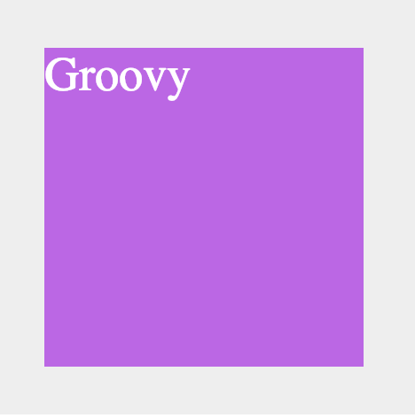
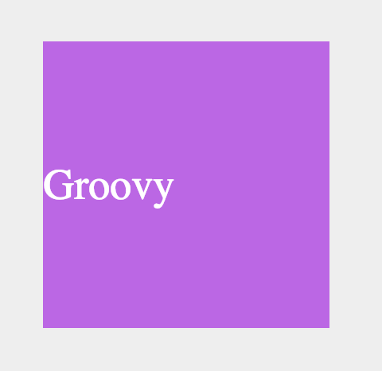
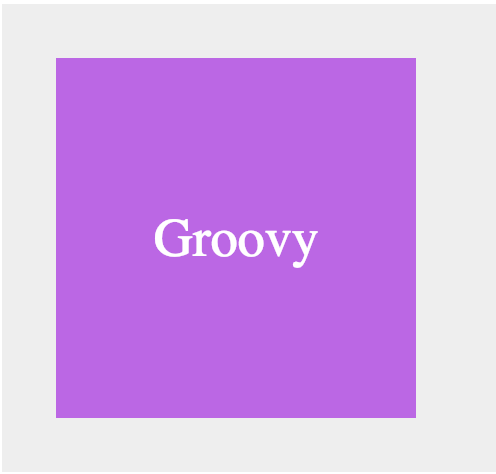

# styled-groove 💃🕺

[](https://github.com/coldbrewcoders)
[](https://npmjs.org/package/styled-groovy)
[](https://travis-ci.org/diegohaz/styled-theme) [](https://codecov.io/gh/diegohaz/styled-theme/branch/master)

A library that provides dynamic, component-level, styling via React props. The intent is to build atop styled-components 💅🏻 and make styling a component easier and more robust.

## Install
It only takes a single command to install styled-groove and get you grooving.

    $ npm install --save styled-groove
    or
    $ yarn add styled-groove

## Implementation without Theme

```js
import styled from "styled-components";
import applyGroove from "styled-groove";

const Title = styled.h1`
  font-size: 1.5em;
  text-align: center;
  color: #fff;

  ${(props) => applyGroove(props)}
`;
```

## Implementation with Theme
https://www.styled-components.com/docs/advanced#theming
```jsx
import applyGroove from "styled-groove";

// Define what props.theme will look like
const theme = {
  applyGroove: (props) => applyGroove(props)
};

...

render(
  <div>
    <ThemeProvider theme={theme}>
      <Title>Themed</Title>
    </ThemeProvider>
  </div>
);
```

```js
import styled from "styled-components";

const Title = styled.h1`
  font-size: 1.5em;
  text-align: center;
  color: #fff;

  ${(props) => props.theme.applyGroove(props)}
`;
```

## How It Works
`styled-groove` in its simplest form is an object that contains CSS properties for use in components.

The applyGroove() function loops through the Component props and maps them to the applicable styles so you don't have to.

The intent is to remove the repetition of adding styles to component declarations and make applying styles dynamic based on the UI/UX needs.

# Examples 
## Before & After
By allowing styles to be applied in-line to the Components, there becomes less of a need to define new components 
### Before
```jsx
const PrimaryButton1 = styled(PrimaryButton)`
  margin-right: 4px;
  ...
`;
const PrimaryButton2 = styled(PrimaryButton)`
  margin-left: 4px;
  ...
`;
<PrimaryButton1>Button 1</PrimaryButton1>
<PrimaryButton2>Button 2</PrimaryButton2>
```
### After
```jsx
<PrimaryButton1 marginRight="4px">Button 1</PrimaryButton1>
<PrimaryButton2 marginLeft="4px">Button 2</PrimaryButton2>
```


## Common Uses

Example 1:

```jsx
import styled from "styled-components";
import applyGroove from "styled-groove";


const color1 = "#DA78F4";
const color2 = "#252025";

const Text = styled.p`
  font-size: 20px;
  margin: 0;
  font-family: 'Arial, sans-serif';
  ${props => applyGroove(props)}
`;

const Div = styled.div`
  ${props => applyGroove(props)}
`;

.
.
.

<Div width="300px">
  <Div backgroundColor={color2}>
    <Text color={color1}>Start</Text>
  </Div>
  <Div textAlign="center" backgroundColor={color1}>
    <Text color={color2}>Groovin'</Text>
  </Div>
  <Div textAlign="right" backgroundColor={color2}>
    <Text color={color1}>Now!</Text>
  </Div>
</Div>
```


Example 2: 

```jsx
import styled from "styled-components";
import applyGroove from "styled-groove";

const Container = styled.div`
  background-color: #DA78F4;
  width: 500px;
`;

const PyramidBlock = styled.div`
  background-color: #252025;
  height: 50px;
  margin: auto;
  ${props => applyGroove(props)}
`;

.
.
.

<Container width="300px">
  <PyramidBlock width="25%" />
  <PyramidBlock width="40%" />
  <PyramidBlock width="55%" />
  <PyramidBlock width="70%" />
  <PyramidBlock width="85%" />
  <PyramidBlock width="100%" />
</Container>
```


## Flexbox
### Basic Flexbox

A basic `display: flex` Flexbox in a container.


#### How its achieved: 

```jsx
import applyGroove from "styled-groove";
import styled from "styled-components";

const Container = styled.div`
  background-color: #eee;
  padding: 30px;
  color: #fff;
  font-size: 30px;
`;

const Flexbox = styled.div`
  background-color: #c95eeb;
  width: 200px;
  height: 200px;
`;

function App() {
  return (
    <Container backgroundColor="#eee">
      <Flexbox isFlex>Groovy</Flexbox>
    </Container>
  );
}
```

###Horizontally Centered Flexbox

Adding horizontal alignment is as simple as passing one `hCentered` prop. It will take care of `justify-content` being "center".


#### How its achieved: 

```jsx
return (
  <Container fontSize="30px" backgroundColor="#eee">
    <Flexbox isFlex hCentered>
      Groovy
    </Flexbox>
  </Container>
);
```

Adding horizontal alignment is as simple as passing one `hCentered` prop. It will take care of `align-items` being "center".

###Vertically Centered Flexbox

#### How its achieved: 

```jsx
return (
  <Container fontSize="30px" backgroundColor="#eee">
    <Flexbox isFlex vCentered>
      Groovy
    </Flexbox>
  </Container>
);
```

###Centered Flexbox
Adding horizontal alignment is as simple as passing one `hCentered` prop. It will take care of justify-content and `align-items` being "center".


#### How its achieved: 

```jsx
return (
  <Container fontSize="30px" backgroundColor="#eee">
    <Flexbox isFlex centered>
      Groovy
    </Flexbox>
  </Container>
);
```

## Responsive Groove


## Available styles to apply via props
### Display

| Prop (key)    | Template Literal CSS Fn (value)     |
| --------------|:------------------------------------:
| display       | (value) => css`display: ${value};`  |
|               | right-aligned                       |
| col 2 is      | centered                            |
| zebra stripes | are neat                            |
