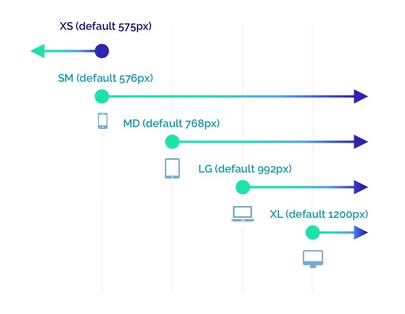
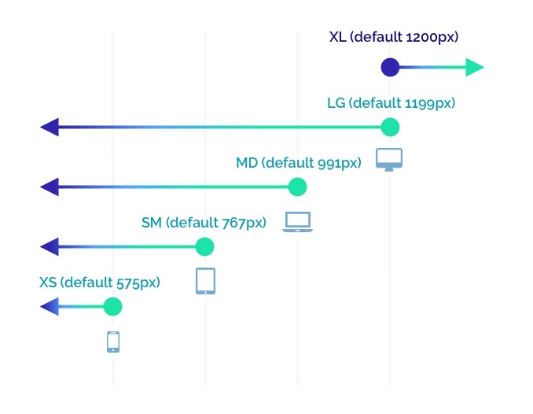

# styled-groove 💃🕺


[](https://coveralls.io/github/coldbrewcoders/styled-groove?branch=master)


A library used with `styled-components` 💅🏻that provides dynamic, component-level styling via props. Extending your components with `styled-groove` allows for more flexibility and reusability in your styled components. `Styled-groove` also has rich feature support for responsive styling. 


## Install

```
$ npm install --save styled-groove
or
$ yarn add styled-groove
```


## Quick Start

Apply Groove to any styled component by adding the `applyGroove()` function to the bottom of your `styled` template.

```js
import styled from "styled-components";
import applyGroove from "styled-groove";

const Example = styled.div`
  .
  .
  .

  ${props => applyGroove(props)}
`;
```


## How It Works
`styled-groove` is a mixin that contains most CSS properties. The `applyGroove()` function examines the props passed to the component, finds applicable styles and injects them as valid CSS to style your component.

The primary intent is to remove the repetition of having to declare multiple styled-components in favor of declaring one and, if needed, extending it on a per use basis.


# Examples 
## Before & After
By allowing styles to be applied to components in-line, there becomes less of a need to define new styled-components. This is a simple example, but highlights the main purpose of `styled-groove`.

### Before:
```jsx
import styled from "styled-components";

const Button1 = styled.button`
  background-color: #4CAF50;
  border: none;
  color: white;
  text-align: center;
  display: inline-block;
  font-size: 16px;
  cursor: pointer;
  margin-right: 4px;
`;

const Button2 = styled.button`
  background-color: #4CAF50;
  border: none;
  color: white;
  text-align: center;
  display: inline-block;
  font-size: 16px;
  cursor: pointer;
  margin-left: 4px;
`;

.
.
.

<Button1>Save</Button1>
<Button2>Cancel</Button2>
```

### After:
```jsx
import styled from "styled-components";
import applyGroove from "styled-groove";

const Button = styled.button`
  background-color: #4CAF50;
  border: none;
  color: white;
  text-align: center;
  display: inline-block;
  font-size: 16px;
  cursor: pointer;

  ${props => applyGroove(props)}
`;

.
.
.

<Button marginRight="4px">Save</Button>
<Button marginLeft="4px">Cancel</Button>
```

## Implementation with Theme
https://www.styled-components.com/docs/advanced#theming

If you're using a theme object with `styled-components`, you can add `applyGrove` to make it available in every styled-component definition. Also, if you use any custom config options (config options will be discussed below), this is an ideal implementation for your customizations to be applied throughout your entire app.

```jsx
import { ThemeProvider } from "styled-components";
import applyGroove from "styled-groove";

const theme = {
  .
  .
  .

  // Default settings for applyGroove
  applyGroove
};

or

import { ThemeProvider } from "styled-components";
import { applyGrooveCustomConfig } from "styled-groove";

// Defining theme
const theme = {
  ...,

  // Custom config for applyGroove
  applyGroove: applyGrooveCustomConfig({
    mediaStrategy: "down",
    mediaBreakpoints: { xs: 255, sm: 320, md: 450, lg: 799, xl: 800 }
  })
};

...

// Wrap your app in styled-component's ThemeProvider
<ThemeProvider theme={theme}>
  ...
</ThemeProvider>

```

Now we have access to `applyGroove` in all of our styled components via the theme object.

```js
import styled from "styled-components";

const Title = styled.h1`
  font-size: 1.5em;
  text-align: center;
  color: #fff;

  // Access to appGroove() in any styled-component
  ${(props) => props.theme.applyGroove(props)}
`;
```


# Style Props:

### Display props:

| Prop          | Injected CSS                |
| ------------- |:----------------------------|
| display       | `display: ${value};`        |
| position      | `position: ${value};`       |
| float         | `float: ${value};`          |
| clear         | `clear: ${value};`          |
| overflow      | `overflow: ${value};`       |
| overflowX     | `overflow-x: ${value};`     |
| overflowY     | `overflow-y: ${value};`     |
| visibility    | `visibility: ${value};`     |
| zIndex        | `z-index: ${value};`        |


### Sizing props:

| Prop          | Injected CSS              |
| --------------|:--------------------------|
| height        | `height: ${value};`       |
| width         | `width: ${value};`        |
| minHeight     | `min-height: ${value};`   | 
| minWidth      | `min-width: ${value};`    |
| maxHeight     | `max-height: ${value};`   |
| maxWidth      | `max-width: ${value};`    |


### Margin props:

| Prop          | Injected CSS                                     |
| --------------|:-------------------------------------------------|
| margin        | `margin: ${value};`                              |
| marginTop     | `margin-top: ${value};`                          |
| marginBottom  | `margin-bottom: ${value};`                       | 
| marginLeft    | `margin-left: ${value};`                         |
| marginRight   | `margin-right: ${value};`                        |
| marginX       | `margin-left: ${value}; margin-right: ${value};` |
| marginY       | `margin-top: ${value}; margin-bottom: ${value};` |


### Padding props:

| Prop          | Injected CSS                                       |
| --------------|:---------------------------------------------------|
| padding       | `padding: ${value};`                               |
| paddingTop    | `padding-top: ${value};`                           |
| paddingBottom | `padding-bottom: ${value};`                        |  
| paddingLeft   | `padding-left: ${value};`                          |
| paddingRight  | `padding-right: ${value};`                         |
| paddingX      | `padding-left: ${value}; padding-right: ${value};` |
| paddingY      | `padding-top: ${value}; padding-bottom: ${value};` |


### Positioning props:

| Prop          | Injected CSS                   |
| --------------|:-------------------------------|
| top           | `top: ${value};`               |
| bottom        | `bottom: ${value};`            |
| left          | `left: ${value};`              |
| right         | `right: ${value};`             |


### Typography props:

| Prop          | Injected CSS                   |
| --------------|:-------------------------------|
| color         | `color: ${value};`             |
| fontSize      | `font-size: ${value};`         |
| fontWeight    | `font-weight: ${value};`       |
| fontFamily    | `font-family: ${value};`       |
| fontStyle     | `font-style: ${value};`        |
| textAlign     | `text-align: ${value};`        |
| textDecoration| `text-decoration: ${value};`   |
| hoverColor    | `&&{&:hover{color: ${value};}}`|
| lineHeight    | `line-height: ${value};`       |
| letterSpacing | `letter-spacing: ${value};`    |
| hyphens       | `hyphens: ${value};`           |
| textOverflow  | `text-overflow: ${value};`     |
| textShadow    | `text-shadow: ${value};`       |
| textTransform | `text-transform: ${value};`    |
| light         | `font-weight: 300;`            |
| bold          | `font-weight: bold;`           |


### Border props:

| Prop                    | Injected CSS                                                                  |
| ------------------------|:------------------------------------------------------------------------------|
| border                  | `border: ${value};`                                                           |
| borderTop               | `border-top: ${value};`                                                       |
| borderBottom            | `border-bottom: ${value};`                                                    |
| borderRight             | `border-right: ${value};`                                                     |
| borderLeft              | `border-left: ${value};`                                                      |
| borderColor             | `border-color: ${value};`                                                     |
| borderRadius            | `border-radius: ${value};`                                                    |
| borderTopLeftRadius     | `border-top-left-radius: ${value};`                                           |
| borderTopRightRadius    | `border-top-right-radius: ${value};`                                          |
| borderBottomRightRadius | `border-bottom-right-radius: ${value};`                                       |
| borderBottomLeftRadius  | `border-bottom-left-radius: ${value};`                                        |
| borderRightRadius       | `border-top-right-radius: ${value}; border-bottom-right-radius ${value};`     |
| borderLeftRadius        | `border-top-left-radius: ${value}; border-bottom-left-radius ${value};`       |
| borderTopRadius         | `border-top-left-radius: ${value}; border-top-right-radius: ${value};`        |
| borderBottomRadius      | `border-bottom-left-radius: ${value}; border-bottom-right-radius: ${value};`  |
| boxShadow               | `box-shadow: ${value};`                                                       |


### Background props:

| Prop                  | Injected CSS                                |
| ----------------------|:--------------------------------------------|
| background            | `background: ${value};`                     |
| backgroundPosition    | `background-position: ${value};`            |
| backgroundRepeat      | `background-repeat: ${value};`              |
| backgroundSize        | `background-size: ${value};`                |
| backgroundImage       | `background-image: url(${value});`          |
| backgroundColor       | `background-color: ${value};`               |
| backgroundHoverColor  | `&&{&:hover{background-color: ${value};}}`  |
| backgroundAttachment  | `background-attachment: ${value};`          |
| backgroundClip        | `background-clip: ${value};`                |
| backgroundOrigin      | `background-origin: ${value};`              |
| objectFit             | `object-fit: ${value};`                     |


### Flexbox props:

| Prop            | Injected CSS                    |
| ----------------|:--------------------------------|
| flex            | `flex: ${value};`               |
| flexDirection   | `flex-direction: ${value};`     |
| flexWrap        | `flex-wrap: ${value};`          |
| justifyContent  | `justify-content: ${value};`    |
| alignItems      | `align-items: ${value};`        |
| alignContent    | `align-content: ${value};`      |
| alignSelf       | `align-self: ${value};`         |
| order           | `order: ${value};`              |
| flexGrow        | `flex-grow: ${value};`          |
| flexShrink      | `flex-shrink: ${value};`        |
| flexBasis       | `flex-basis: ${value};`         |


### Misc props:

| Prop            | Injected CSS                    |
| ----------------|:--------------------------------|
| cursor          | `cursor: ${value};`             |
| direction       | `direction: ${value};`          |
| opacity         | `opacity: ${value};`            |
| overflowWrap    | `overflow-wrap: ${value};`      |
| pointerEvents   | `pointer-events: ${value};`     |
| transform       | `transform: ${value};`          |
| transition      | `transition: ${value};`         |
| transitionDelay | `transition-delay: ${value};`   |
| userSelect      | `user-select: ${value};`        |
| whiteSpace      | `white-space: ${value};`        |
| wordSpacing     | `word-spacing: ${value};`       |
| wordWrap        | `word-wrap: ${value};`          |


#### Example 1:

```jsx
import React from "react";
import styled from "styled-components";
import applyGroove from "styled-groove";


const colorA = "#1d2033";
const colorB = "#0ac6ad";

const Row = styled.div`
  width: 100vw;
  height: 33vh;
  display: flex;
  align-items: center;

  // Apply groove to your styled component
  ${props => applyGroove(props)}
`;

const Text = styled.p`
  font-size: 52px;
  font-family: "Arial, sans-serif";
  margin: 0;

  // Apply groove to your styled component
  ${props => applyGroove(props)}
`;

export default () => (
  <div>
    <Row backgroundColor={colorA}>
      <Text color={colorB} marginLeft="24px">Start🕺</Text>
    </Row>
    <Row backgroundColor={colorB} justifyContent="center">
      <Text color={colorA}>Groovin</Text>
    </Row>
    <Row backgroundColor={colorA} justifyContent="flex-end">
      <Text color={colorB} marginRight="24px">💃Now!</Text>
    </Row>
  </div>
);

```


[](https://codesandbox.io/s/example-1-rrp8c?autoresize=1&fontsize=14&hidenavigation=1&module=%2Fsrc%2FExampleOne.jsx&moduleview=1)


#### Example 2: 

```jsx
import React from "react";
import styled from "styled-components";
import applyGroove from "styled-groove";

const colorA = "#1d2033";
const colorB = "#0ac6ad";

const Container = styled.div`
  background-color: ${colorA};
  width: 100vw;
  height: 100vh;
`;

const Block = styled.div`
  background-color: ${colorB};
  height: 10vh;
  margin: auto;

  // Apply groove to your styled component
  ${props => applyGroove(props)}
`;

const Text = styled.p`
  color: ${colorA};
  font-size: 30px;
  font-family: "helvetica, sans-serif";
  margin: 0;

  // Apply groove to your styled component
  ${props => applyGroove(props)}
`;

export default () => (
  <Container>
    <Block width="100vw" />
    <Block width="80vw" />
    <Block width="60vw" />
    <Block width="40vw" />
    <Block width="20vw" display="flex" justifyContent="center">
      <Text>Styled</Text>
    </Block>
    <Block width="20vw" display="flex" justifyContent="center" alignItems="flex-end">
      <Text bold>Groove</Text>
    </Block>
    <Block width="40vw" />
    <Block width="60vw" />
    <Block width="80vw" />
    <Block width="100vw" />
  </Container>
);
```


[](https://codesandbox.io/s/eloquent-benz-se33j?autoresize=1&fontsize=14&hidenavigation=1&module=%2Fsrc%2FExampleTwo.jsx&moduleview=1)


# Media Props

Using media props, you can adjust the styles applied to your components at different screen widths aka media breakpoints. This makes it easy to build responsive components that look great on any device. Here is an illustration of how it works...



`Styled-groove` uses the up media strategy by default, similar to bootstrap. If you'd prefer to use the down media strategy or to change the media breakpoint size values, this can be achieved via custom configuration (will be discussed later).

There are 5 media props you can use to apply styles at varying screen widths. They are `_xs`, `_sm`, `_md`, `_lg` and `_xl`. Each media prop expects an object as its value which contains key -> value pairs of style props to apply when the screen width triggers its corresponding media breakpoint.

#### Responsive Example: 

```jsx
import React from "react";
import styled from "styled-components";
import applyGroove from "styled-groove";


const BoxWithResponsiveColors = styled.div`
  width: 200px;
  height: 200px;
  margin: auto;
  text-align: center;
  color: white;
  padding-top: 64px;
  border: 1px solid black;

  // Apply groove to your styled component
  ${props => applyGroove(props)}
`;

export default () => (
  <BoxWithResponsiveColors _xs={{ backgroundColor: "red" }} _sm={{ backgroundColor: "orange" }} _md={{ backgroundColor: "yellow" }} _lg={{ backgroundColor: "green" }} _xl={{ backgroundColor: "blue" }} />
);
```

[](https://codesandbox.io/s/cool-ramanujan-7of90?autoresize=1&fontsize=14&hidenavigation=1&module=%2Fsrc%2FMediaPropsExample.jsx)

Here we are only using the `backgroundColor` style prop inside the media prop object, but you can pass in any combination and as many or as few style props as you need. 

This example uses all of the available media props, but you can use as many or as few as your component requires. Also, you can arrange the media props in any order you like and the results will be the same. However, we do recommend writing them in ascending or descending order for readability purposes.


# Custom Configuration

The `applyGrove` function has an optional 2nd argument that allows you to customize its behavior. We call this the config object. All properties of the config object are optional and if properties are not passed or passed in an invalid format, `styled-groove` will use its default values. The config object has the following available properties:

| Config Object Properties  | Options                                                                                     |
| --------------------------|:--------------------------------------------------------------------------------------------|
| mediaStrategy             | `"up" or "down" (default is "up")`                                                          |
| mediaBreakpoints          | `{ xs?: number, sm?: number, md?: number, lg?: number, xl?: number }`                       |
|                           | `defaults for "up" media strategy: { xs: 575 , sm: 576 , md: 768 , lg: 992 , xl: 1200 }`    |
|                           | `defaults for "down" media strategy: { xs: 575 , sm: 767 , md: 991 , lg: 1199 , xl: 1200 }` |
| ignoreMediaMixins         | `true or false (default is false)`                                                          |


#### mediaStrategy

This config options allows you to flip the way media props are applied. Default is "up", but if set to "down", media props will behave in the following way:




#### mediaBreakpoints

This allows you to override the default media breakpoints. You can pass any sizes as long as they respect the following rules:
1. XL > LG > MD > SM > XS
2. If mediaStrategy is "up", SM - XS must be 1. (This prevents a gap in media prop coverage)
3. If mediaStrategy is "down", XL - LG must be 1. (This prevents a gap in media prop coverage)


#### ignoreMediaMixins

When set to true, `styled-groove` will not look for any media props. Only set this to true if you know your component will not be using any media props. This will result in a small optimization of render speed.